# mijn-json-kleurkrijt

Een razendsnelle C++ bibliotheek en CLI tool voor gekleurde JSON weergave. Bevat een Python module (pybind11) en een standalone `wjq` command-line tool met jq-compatibele query engine.

## Features

### Core Library (C++ / Python)
- **Performance**: Volledig C++ met simdjson (SIMD-optimized) — 50-100x sneller dan pure Python
- **JSON String Input**: Direct JSON parsen met GIL release voor multi-threaded performance
- **Value-Dependent Styling**: Rule-based kleuring op basis van waarden (`true` = groen, `false` = rood)
- **StyleRule & Matcher API**: `KeywordMatcher`, `RegexMatcher`, `RangeMatcher` voor flexibele value matching
- **Export formaten**: Console (ANSI), HTML, Markdown
- **Kleurmodi**: Auto-detectie, 16, 256, truecolor, disabled
- **Type hints**: Volledige `.pyi` stubs voor IDE ondersteuning

### wjq — Windows JSON Query Tool
- **jq-compatibele query engine** met ondersteuning voor:
  - Property access: `.name`, `.user.age`, `.[0]`
  - Array iteration: `.users[]`, `.items[0:5]`
  - Pipe: `.users | map(.name)`
  - Filtering: `select(.age > 18)`
  - Object/array construction: `{name: .first}`, `[.a, .b]`
  - String interpolation: `"User \(.name) is \(.age)"`
  - Mutation: `.name = "x"`, `.age |= . + 1`
  - Regex: `test("pattern")`, `match("regex")`, `sub("old", "new")`
  - Try/catch: `try .x`, `.x?`, `try .x catch "fallback"`
  - Variable bindings: `.name as $n | {user: $n}`
  - Arithmetic: `. + 1`, `. * 2`, `. / 3`
  - Boolean logic: `and`, `or`, `not`
  - Functies: `keys`, `values`, `length`, `sort`, `unique`, `reverse`, `compact`, `has`, `contains`
- **JSONPath** queries: `$.store.book[0]`, `$..author`, `$..book[?(@.price<10)]`
- **Streaming parser** met `simdjson::iterate_many` voor grote bestanden en NDJSON
- **22+ kleurthema's** met boolean true/false kleuring

---

## Installatie

### Vereisten

- C++17 compiler (MSVC, GCC, of Clang)
- CMake 3.14+
- Python 3.8+ (voor de Python module)
- pybind11 (automatisch via pip)

### Python Module

```bash
# Clone met submodules
git clone --recurse-submodules <repository-url>
cd mijn-json-kleurkrijt

# Installeer met uv
uv pip install -e .

# Of met dev dependencies
uv pip install -e ".[dev]"
```

### wjq Tool (standalone C++ executable)

```bash
# Vanuit de project root:
cmake -B build -G "Visual Studio 17 2022"
cmake --build build --config Release

# Executable: build/wjq/Release/wjq.exe
```

---

## wjq Gebruik

### Basis

```bash
# Pretty-print een JSON bestand
wjq data.json

# Met thema
wjq -t dracula data.json

# Van stdin
cat data.json | wjq

# Compact mode
wjq -c data.json
```

### Query Filters (jq-stijl)

```bash
# Property access
wjq '.name' data.json
wjq '.users[0].email' data.json

# Array iteratie
wjq '.users[].name' data.json

# Pipe en functies
wjq '.users | length' data.json
wjq '.users | map(.name)' data.json
wjq '.users | select(.active)' data.json

# Object constructie
wjq '{name: .first_name, age: .years}' data.json

# String interpolatie
wjq '"User \(.name) is \(.age) years old"' data.json

# Variable bindings
wjq '.name as $n | {user: $n, years: .age}' data.json

# Regex
wjq '.email | test("@gmail")' data.json

# Arithmetic
wjq '.price | . * 1.21' data.json

# Try/catch
wjq 'try .missing_field catch "not found"' data.json

# Verwijder keys met lege strings of null waarden
wjq 'compact()' data.json
echo '{"a": 1, "b": "", "c": null}' | wjq 'compact()'
# Output: {"a": 1}
```

### JSONPath Queries

```bash
wjq '$.store.book[0]' data.json
wjq '$..author' data.json
wjq '$..book[?(@.price<10)]' data.json
```

### CLI Flags

```
Formatting:
  -c, --compact          Compacte output
  -i, --indent N         Indent grootte (1-8, standaard: 2)
  -r, --raw-output       Strings zonder JSON quotes
  -s, --slurp            Lees stream van documenten als array
  -t, --theme NAAM       Kleurthema kiezen
  -m, --color-mode MODE  Kleurmodus: auto, 16, 256, truecolor, disabled

Variables:
  --arg name value       String variabele doorgeven als $name
  --argjson name value   JSON variabele doorgeven als $name

Streaming:
  -S, --streaming        Streaming parser voor grote bestanden
  -l, --line-by-line     JSONL line-by-line parsing

Data transformatie:
  --hide-sensitive       Verberg wachtwoorden, tokens, secrets
  --truncate N           Strings afkappen op N karakters
  --format-numbers       Duizendtallen-separator toevoegen
  --clean                Verwijder keys met lege strings of null waarden

Informatie:
  --themes               Toon beschikbare thema's
  -h, --help             Toon help
  -v, --version          Toon versie
```

### Voorbeelden

```bash
# Raw output voor scripting
echo '{"name":"Alice"}' | wjq -r '.name'
# Output: Alice

# Slurp meerdere documenten in array
echo '{"a":1}{"b":2}{"c":3}' | wjq -s '.'
# Output: [{"a":1},{"b":2},{"c":3}]

# Variabelen doorgeven
echo '{"items":[1,2,3]}' | wjq --argjson limit 2 '.items[:$limit]'

# Dracula theme met 256 kleuren
wjq -t dracula -m 256 data.json

# Streaming voor grote bestanden
wjq -S large-file.json

# Realtime streaming uit een pipe
trufflehog filesystem /pad/naar/files --json | wjq

# Opschonen van JSON (verwijder lege/null waarden)
echo '{"name": "test", "empty": "", "null_val": null}' | wjq --clean
# Output: {"name": "test"}
```

---

## Realtime Streaming

`wjq` is geoptimaliseerd voor realtime weergave van JSON streams. Wanneer de output van een ander programma (zoals `trufflehog`, `docker logs`, of een custom script) naar `wjq` wordt gepiped:
- Wordt elk JSON document **direct** geprocessed en weergegeven.
- Blijven de **kleuren behouden**, zelfs op Windows waar TTY-detectie normaal gesproken lastig is in pipes.
- Wordt de output geflusht voor minimale latency.

---

## Python Module

### Quick Start

```python
import colored_json

# Basis gebruik
data = {"name": "Alice", "age": 30, "active": True}
colored_json.print(data)

# Met preset thema
style = colored_json.Style.get_preset("dracula")
colored_json.print(data, style)

# JSON string input (sneller met simdjson)
json_str = '{"name": "Alice", "age": 30, "active": true}'
result = colored_json.format_from_json(json_str, style)
```

### Value-Dependent Styling

```python
import colored_json

# Boolean kleuring is standaard ingebouwd in alle thema's:
# true = groen, false = rood
data = {"enabled": True, "debug": False, "count": 42}
colored_json.print(data)

# Custom styling rules
style = colored_json.Style.get_preset("default")
# Voeg custom matchers toe via de StyleRule API
```

### Export Formaten

```python
import colored_json

data = {"user": {"name": "Alice", "age": 30}}
style = colored_json.Style.get_preset("dracula")

# HTML
html = colored_json.to_html(data, style, title="My JSON", background_color="#282a36")

# Markdown
md = colored_json.to_markdown(data, style, title="JSON Data")

# Markdown met HTML kleuren
md_html = colored_json.to_markdown_html(data, style, background_color="#282a36")
```

### Custom Kleuren

```python
import colored_json

style = colored_json.Style()
style.key_color = colored_json.Color(255, 100, 0)
style.key_color.bold = True
style.string_color = colored_json.colors.bright_green
style.number_color = colored_json.colors.bright_yellow
style.indent_size = 4

# Per-key kleuring
style.set_key_color("user", colored_json.Color(255, 0, 0))
style.set_value_color("user.name", colored_json.Color(255, 20, 147))

colored_json.print({"user": {"name": "Alice"}}, style)
```

### Beschikbare Thema's
## Kleurthema Gallery

Hieronder vind je een overzicht van alle beschikbare thema's. Klik op een thema om de weergave te openen:

<details>
<summary>Thèma: <b>catppuccin</b></summary>

Zachte pastelkleuren, rustgevend voor de ogen.
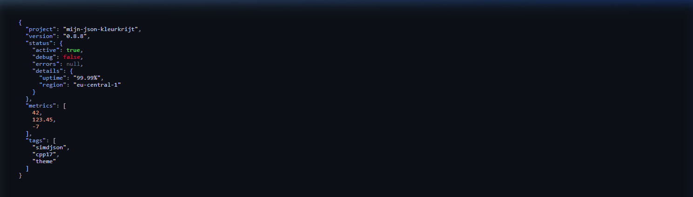
</details>

<details>
<summary>Thèma: <b>coffee</b></summary>

Warme bruintinten, alsof je in een koffiebar zit.
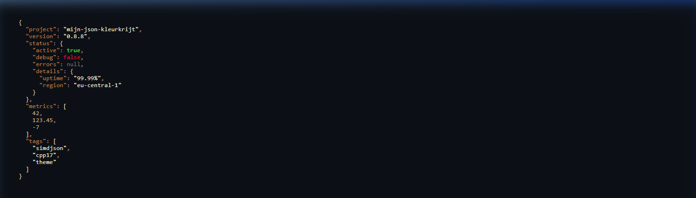
</details>

<details>
<summary>Thèma: <b>cyberpunk</b></summary>

High-contrast neon roze en groen, recht uit Night City.
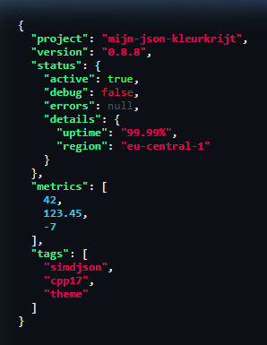
</details>

<details>
<summary>Thèma: <b>data-analysis</b></summary>

Speciaal voor arrays: highlight het eerste, laatste en even/oneven elementen.
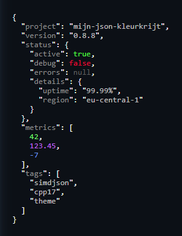
</details>

<details>
<summary>Thèma: <b>debug</b></summary>

Focus op fouten: 'error' wordt rood, 'warn' geel, en grote cijfers vallen op.
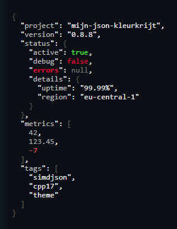
</details>

<details>
<summary>Thèma: <b>default</b> (Dracula)</summary>

De vertrouwde Dracula-gebaseerde look, geoptimaliseerd voor dark mode.
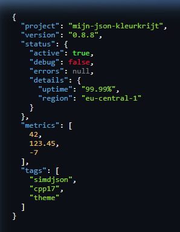
</details>

<details>
<summary>Thèma: <b>depth-aware</b></summary>

Krijg grip op diepe nesting: elke laag heeft zijn eigen unieke kleur.
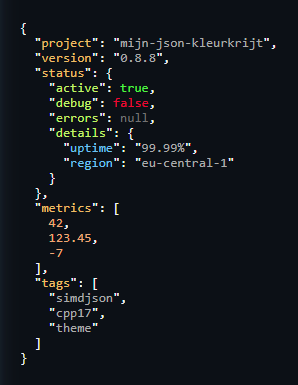
</details>

<details>
<summary>Thèma: <b>dracula</b></summary>

De klassieke Dracula-ervaring met heldere paars- en geeltinten.
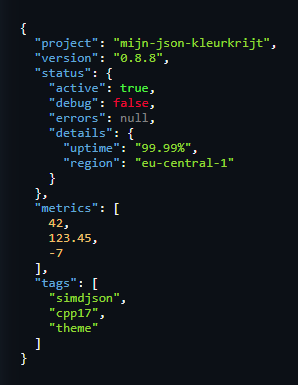
</details>

<details>
<summary>Thèma: <b>forest</b></summary>

Natuurlijke groen- en aardetinten voor een rustige workflow.
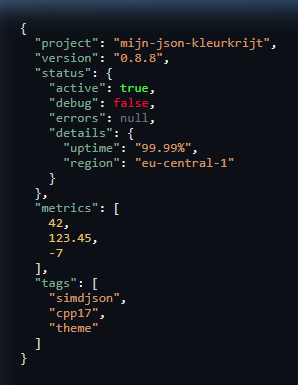
</details>

<details>
<summary>Thèma: <b>github</b></summary>

De herkenbare look van GitHub, ideaal voor licht getinte omgevingen.
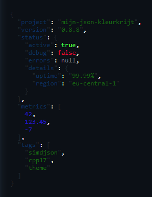
</details>

<details>
<summary>Thèma: <b>gruvbox</b></summary>

Retro look met crème-witte tekst en warme achtergronden.
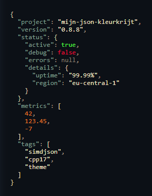
</details>

<details>
<summary>Thèma: <b>high-contrast</b></summary>

Maximale leesbaarheid met felle, contrasterende kleuren en vette tekst.
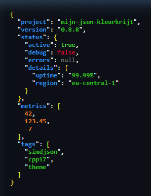
</details>

<details>
<summary>Thèma: <b>ice</b></summary>

Gekoelde blauwtinten en helderwitte teksten voor een frisse look.
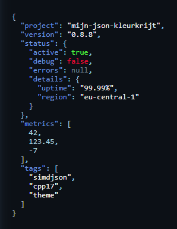
</details>

<details>
<summary>Thèma: <b>minimal</b></summary>

Geen poespas: subtiele grijstinten die niet afleiden.
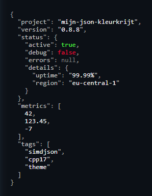
</details>

<details>
<summary>Thèma: <b>monokai</b></summary>

De tijdloze klassieker uit Sublime Text en VS Code.
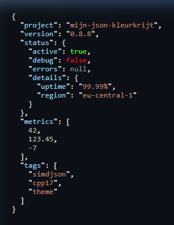
</details>

<details>
<summary>Thèma: <b>neon</b></summary>

Futuristische neon-kleuren die van je scherm spatten.
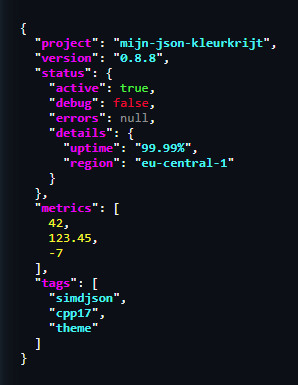
</details>

<details>
<summary>Thèma: <b>nord</b></summary>

Arctisch blauw en sneeuwwit, gebaseerd op het populaire Nord palet.
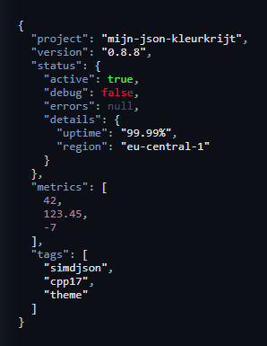
</details>

<details>
<summary>Thèma: <b>ocean</b></summary>

Diepe blauwtinten gecombineerd met frisse zeegroene accenten.
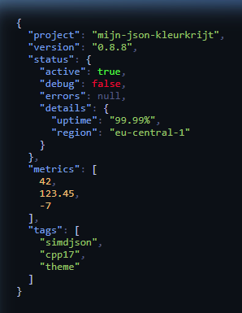
</details>

<details>
<summary>Thèma: <b>one-dark</b></summary>

Geïnspireerd door Atom's One Dark: gebalanceerd en modern.
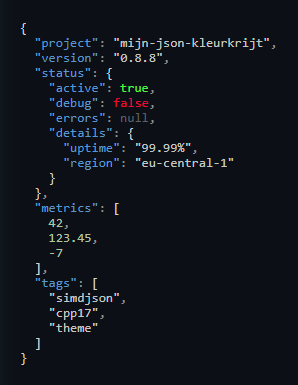
</details>

<details>
<summary>Thèma: <b>solarized</b></summary>

Op wetenschappelijke basis ontworpen contrast voor optimaal leescomfort.
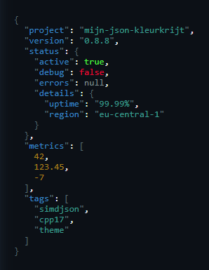
</details>

<details>
<summary>Thèma: <b>sunset</b></summary>

Warme oranje- en roodtinten van een zomeravond.
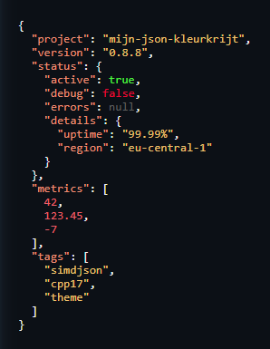
</details>

<details>
<summary>Thèma: <b>white</b></summary>

Speciaal voor witte achtergronden met helderblauwe keys.
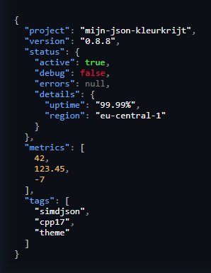
</details>


## Build & Development

### Project Structuur

```
mijn-json-kleurkrijt/
├── src/                    # Core C++ library
│   ├── printer.hpp         # Console printer (ANSI)
│   ├── html_printer.hpp    # HTML export
│   ├── markdown_printer.hpp # Markdown export
│   ├── style.hpp           # Style configuratie
│   ├── color.hpp           # Color class en ANSI conversie
│   ├── themes.hpp          # 21+ ingebouwde thema's
│   ├── matchers.hpp/cpp    # Value matching engine
│   ├── style_context.hpp   # Rule-based styling context
│   └── bindings.cpp        # Python pybind11 bindings
├── wjq/                    # wjq CLI tool
│   ├── src/
│   │   ├── main.cpp        # CLI entry point
│   │   ├── query_engine.hpp # Query AST types
│   │   ├── query_parser.cpp # jq expression parser
│   │   ├── query_executor.cpp # Query execution engine
│   │   ├── jsonpath.hpp     # JSONPath types
│   │   ├── jsonpath_executor.cpp # JSONPath + unified query API
│   │   └── streaming_parser.hpp # NDJSON streaming
│   └── tests/              # Catch2 unit tests
│       ├── test_query.cpp   # Query engine tests (91 cases)
│       ├── test_printer.cpp # Printer tests
│       ├── test_style.cpp   # Style/theme tests
│       └── test_streaming.cpp # Streaming parser tests
├── examples/               # Python voorbeelden
├── CMakeLists.txt          # Root CMake
└── setup.py                # Python package setup
```

### Bouwen

```bash
# Volledige build (Python module + wjq tool)
cmake -B build -G "Visual Studio 17 2022"
cmake --build build --config Release

# Alleen wjq tool
cmake --build build --config Release --target wjq
```

### Tests

```bash
# C++ unit tests (wjq)
build\wjq\tests\Release\wjq_tests.exe

# Python tests
uv run pytest tests/ -v
```

## Technische Details

- **C++ Standard**: C++17
- **JSON Parser**: simdjson (SIMD-optimized, GB/s throughput)
- **Test Framework**: Catch2 v3
- **Python Binding**: pybind11
- **Platforms**: Windows, Linux, macOS
- **Compilers**: MSVC, GCC, Clang

## Licentie

[Voeg licentie toe]
